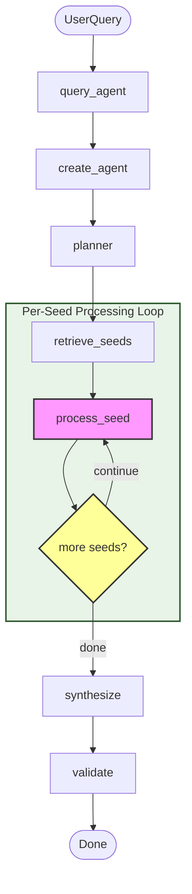
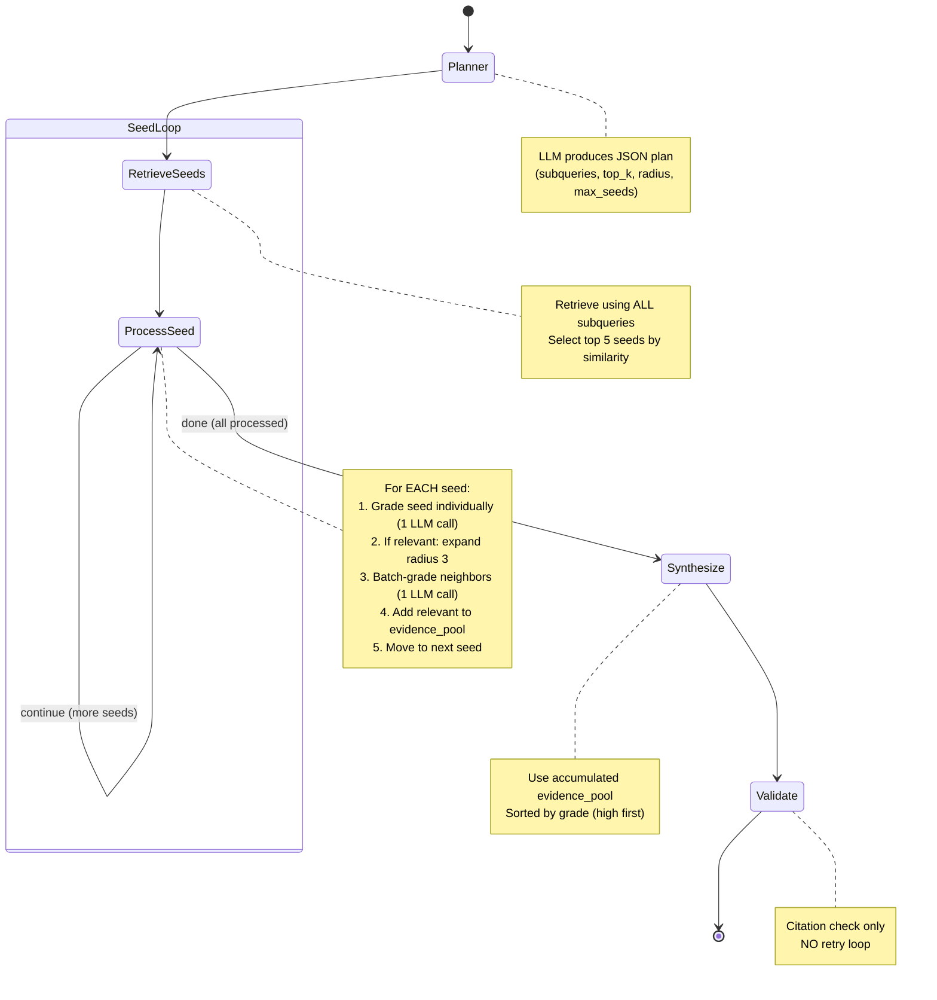

# Retrieval Agent Architecture Flowchart

## Overview
This document visualizes the LangGraph-based agentic retrieval system with **per-seed processing** architecture.

## Mermaid Flowchart (Interactive)



## LangGraph State Machine (Per-Seed Processing)



## Per-Seed Processing Flow

```
┌─────────────────────────────────────────────────────────────────────────┐
│                    PER-SEED EXPLORATION ARCHITECTURE                     │
└─────────────────────────────────────────────────────────────────────────┘

Planner → Retrieve (top 5 seeds)
              ↓
         ┌────────────────────────────────────────┐
         │         [process_seed] ←──────┐        │
         │              │                │        │
         │         more seeds? ───YES────┘        │
         │              │                         │
         │             NO                         │
         └──────────────┼─────────────────────────┘
                        ↓
               Synthesize → Validate → END

Each process_seed iteration:
┌──────────────────────────────────────────────────────────┐
│  1. Pop first seed from pending_seeds                    │
│  2. Grade seed INDIVIDUALLY (1 LLM call)                 │
│       ↓                                                  │
│  3. Seed relevant (high/medium)?                         │
│       │                                                  │
│      NO → Skip to next seed                              │
│       │                                                  │
│     YES ↓                                                │
│  4. Expand around seed (radius 3)                        │
│  5. Filter out visited nodes                             │
│  6. Batch-grade neighbors (1 LLM call)                   │
│  7. Add seed + relevant neighbors to evidence_pool       │
│  8. Update visited_node_ids (MEMORY)                     │
│  9. Move to next seed                                    │
└──────────────────────────────────────────────────────────┘
```

## Agent State Structure

```
AgentState {
    messages: List[BaseMessage]           # Conversation history
    user_query: str                       # Original user question
    title_collection: str                 # Title-indexed collection name
    text_collection: str                  # Text-indexed collection name
    final_answer: str                     # Final synthesized answer
    plan: Dict[str, Any]                  # Planner output
    validation: Dict[str, Any]            # Citation validation results

    # Per-seed processing state
    pending_seeds: List[Dict[str, Any]]   # Seeds waiting to be processed (max 5)
    visited_node_ids: List[str]           # MEMORY: don't re-process nodes
    evidence_pool: List[Dict[str, Any]]   # Accumulated relevant nodes (ranked)
    processing_complete: bool             # True when all seeds processed
}
```

## Execution Flow Diagram

```
                    START
                     │
                     ▼
        ┌────────────────────────┐
        │  query_agent() called   │
        │  - user_query           │
        │  - title_collection     │
        │  - text_collection      │
        └────────────┬────────────┘
                     │
                     ▼
        ┌────────────────────────┐
        │  create_agent()         │
        │  - Initialize ChatOpenAI│
        │  - Build StateGraph     │
        │  - Add nodes & edges    │
        └────────────┬────────────┘
                     │
                     ▼
        ┌────────────────────────┐
        │  Initialize State       │
        │  - pending_seeds: []    │
        │  - evidence_pool: []    │
        │  - visited_node_ids: [] │
        └────────────┬────────────┘
                     │
                     ▼
        ┌────────────────────────┐
        │   PLANNER               │
        │   - Generate subqueries │
        │   - Set top_k, radius   │
        │   - Set max_seeds (5)   │
        └────────────┬────────────┘
                     │
                     ▼
        ┌────────────────────────┐
        │   RETRIEVE_SEEDS        │
        │   - Search all queries  │
        │   - Dedupe candidates   │
        │   - Select top 5 seeds  │
        └────────────┬────────────┘
                     │
                     ▼
        ┌────────────────────────┐
        │   PROCESS_SEED LOOP     │
        │                         │
        │   For each seed:        │
        │   ├─ Grade individually │
        │   ├─ If relevant:       │
        │   │  ├─ Expand radius 3 │
        │   │  ├─ Batch-grade     │
        │   │  └─ Add to evidence │
        │   └─ Move to next seed  │
        └────────────┬────────────┘
                     │
        ┌────────────┴────────────┐
        │                          │
        ▼                          ▼
┌───────────────┐         ┌───────────────┐
│   continue    │         │     done      │
│  (more seeds) │         │ (all seeds    │
│               │         │  processed)   │
└───────┬───────┘         └───────┬───────┘
        │                          │
        └──────┐                   │
               │                   │
               ▼                   ▼
        ┌──────────────┐   ┌───────────────┐
        │ process_seed │   │   SYNTHESIZE   │
        │   (loop)     │   │   - Use top    │
        └──────────────┘   │     evidence   │
                           │   - Generate   │
                           │     answer     │
                           └───────┬───────┘
                                   │
                                   ▼
                           ┌───────────────┐
                           │   VALIDATE     │
                           │   - Check      │
                           │     citations  │
                           │   - NO retry   │
                           └───────┬───────┘
                                   │
                                   ▼
                           ┌───────────────┐
                           │      END      │
                           │   Return:     │
                           │   - answer    │
                           │   - evidence  │
                           └───────────────┘
```

## Grading Strategy

### Individual Seed Grading
```
grade_single_node(node, query, llm)
    │
    ├─> Send ONE node to LLM
    │   - Title + first 800 chars of text
    │
    ├─> LLM returns: high | medium | low | irrelevant
    │
    └─> Criteria:
        - high: Directly answers or essential
        - medium: Useful context
        - low: Tangentially related
        - irrelevant: Not related
```

### Batch Neighbor Grading
```
grade_neighbors_batch(neighbors, query, llm)
    │
    ├─> Send up to 15 neighbors in ONE LLM call
    │   - Each with first 400 chars of text
    │
    ├─> LLM returns JSON array of grades
    │
    └─> Filter: Keep only high/medium grades
```

## Key Design Patterns

1. **Per-Seed Processing**: Grade each seed individually before expansion
2. **Conditional Expansion**: Only expand around relevant (high/medium) seeds
3. **Memory Tracking**: `visited_node_ids` prevents re-processing
4. **Evidence Accumulation**: `evidence_pool` grows across seed iterations
5. **Ranked Evidence**: High grades first, then by similarity score
6. **Single Loop**: Only the seed processing loop, no post-synthesis retry

## Graph Structure

```
StateGraph
├── Entry Point: "planner"
├── Nodes:
│   ├── "planner" → planner() → generates retrieval plan
│   ├── "retrieve" → retrieve_seeds() → gets top 5 seeds
│   ├── "process_seed" → process_seed() → grades & expands one seed
│   ├── "synthesize" → synthesize_answer() → generates final answer
│   └── "validate" → validate_citations() → checks citation format
└── Edges:
    ├── planner → retrieve
    ├── retrieve → process_seed
    ├── process_seed → route_seed_processing → process_seed/synthesize
    ├── synthesize → validate
    └── validate → END
```

## Data Flow

```
User Query
    ↓
Initial State (pending_seeds=[], evidence_pool=[])
    ↓
Planner → Plan (subqueries, top_k=8, radius=3, max_seeds=5)
    ↓
Retrieve Seeds → pending_seeds=[seed1, seed2, seed3, seed4, seed5]
    ↓
Process Seed 1:
    ├─ Grade: "high" → Expand → Grade neighbors → Add to evidence
    └─ evidence_pool=[seed1, neighbor1, neighbor2]
    ↓
Process Seed 2:
    ├─ Grade: "low" → Skip (not relevant)
    └─ evidence_pool=[seed1, neighbor1, neighbor2]
    ↓
Process Seed 3:
    ├─ Grade: "medium" → Expand → Grade neighbors → Add to evidence
    └─ evidence_pool=[seed1, neighbor1, neighbor2, seed3, neighbor3]
    ↓
... (continue for remaining seeds)
    ↓
Synthesize → Final Answer (with citations from evidence_pool)
    ↓
Validate → Check citation format
    ↓
Result Dictionary (answer, messages, evidence_count)
```

## Quick Reference Summary

### Main Functions

| Function | Purpose | Key Responsibilities |
|----------|---------|---------------------|
| `query_agent()` | Entry point | Sets up state, creates agent, invokes workflow |
| `create_agent()` | Graph builder | Initializes LLM, builds StateGraph, compiles workflow |
| `planner()` | Query planning | Generates subqueries, sets retrieval parameters |
| `retrieve_seeds()` | Initial retrieval | Searches all subqueries, selects top 5 seeds |
| `process_seed()` | Core loop | Grades seed, expands if relevant, grades neighbors |
| `grade_single_node()` | Individual grading | Grades ONE node with LLM |
| `grade_neighbors_batch()` | Batch grading | Grades multiple neighbors in one LLM call |
| `synthesize_answer()` | Answer generation | Creates final answer from evidence pool |
| `validate_citations()` | Quality check | Validates citation format (no retry) |

### Termination Conditions

```
Termination:
├─> All seeds processed → processing_complete = True → Synthesize
└─> No seeds retrieved → processing_complete = True → Synthesize (empty)
```

### Performance Characteristics

- **Max Seeds**: 5 (configurable via planner)
- **Expansion Radius**: 3 nodes in each direction
- **LLM Calls per Seed**: 1 (individual grade) + 1 (batch grade neighbors) = 2 max
- **Total LLM Calls**: 1 (planner) + 10 (5 seeds × 2) + 1 (synthesize) = 12 max
