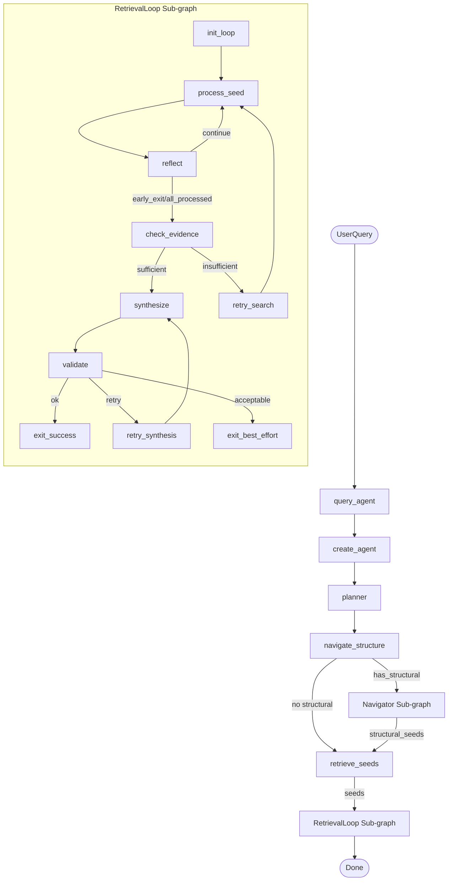
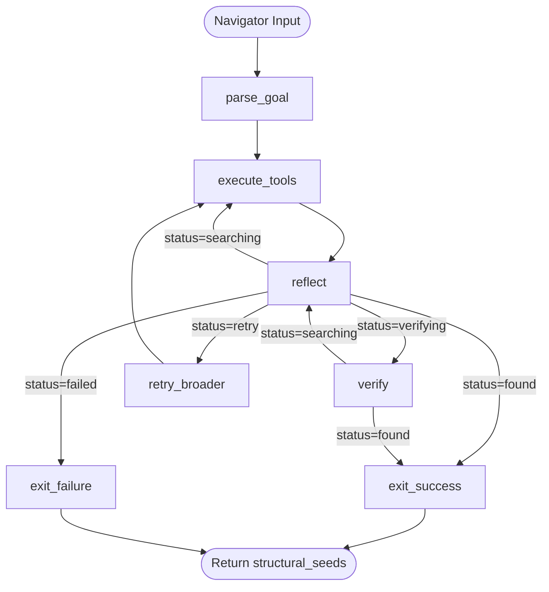
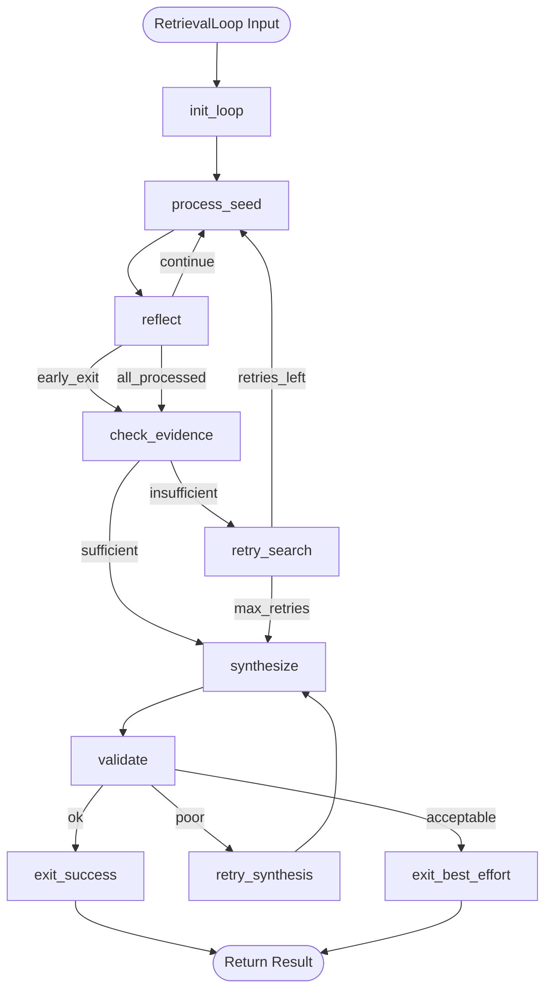
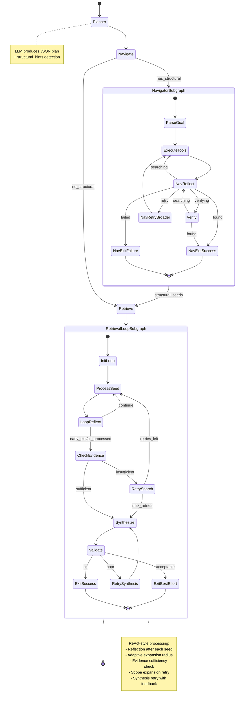

# Retrieval Agent Architecture Flowchart

## Overview
This document visualizes the LangGraph-based agentic retrieval system with **two ReAct-style sub-graphs**:
1. **Navigator Sub-graph**: For structural document navigation (chapter/section finding)
2. **RetrievalLoop Sub-graph**: For ReAct-style seed processing with reflection, adaptation, and retry

## Main Agent Flowchart



## Navigator Sub-graph Flowchart



## RetrievalLoop Sub-graph Flowchart (Detailed)



## Complete State Machine



## Detailed Flow Diagram

```
                    START
                     │
                     ▼
        ┌────────────────────────┐
        │  query_agent() called   │
        │  - user_query           │
        │  - title_collection     │
        │  - text_collection      │
        └────────────┬────────────┘
                     │
                     ▼
        ┌────────────────────────┐
        │  create_agent()         │
        │  - Initialize ChatOpenAI│
        │  - Create Navigator     │
        │    Sub-graph            │
        │  - Create RetrievalLoop │
        │    Sub-graph            │
        │  - Build StateGraph     │
        └────────────┬────────────┘
                     │
                     ▼
        ┌────────────────────────┐
        │   PLANNER               │
        │   - Generate subqueries │
        │   - Set top_k, radius   │
        │   - Detect structural   │
        │     intent              │
        └────────────┬────────────┘
                     │
                     ▼
        ┌────────────────────────┐
        │   NAVIGATE_STRUCTURE    │
        │   (Navigator Sub-graph) │
        │                         │
        │   Returns:              │
        │   structural_seeds      │
        └────────────┬────────────┘
                     │
                     ▼
        ┌────────────────────────┐
        │   RETRIEVE_SEEDS        │
        │                         │
        │   - Add structural      │
        │     seeds               │
        │   - Skip semantic if    │
        │     high-quality        │
        │   - Select seeds        │
        └────────────┬────────────┘
                     │
                     ▼
        ┌────────────────────────────────────────────────────────────┐
        │                 RETRIEVAL LOOP SUB-GRAPH                    │
        │                                                             │
        │   ┌─────────────────────────────────────────────────────┐  │
        │   │  init_loop → process_seed → reflect                  │  │
        │   │       │                          │                   │  │
        │   │       │        ┌─────────────────┘                   │  │
        │   │       │        │                                     │  │
        │   │       │        ▼                                     │  │
        │   │       │    ┌───────────┐                             │  │
        │   │       │    │ continue? │──YES──┐                     │  │
        │   │       │    └───────────┘       │                     │  │
        │   │       │        │               │                     │  │
        │   │       │       NO               │                     │  │
        │   │       │        ▼               │                     │  │
        │   │       │   check_evidence       │                     │  │
        │   │       │        │               │                     │  │
        │   │       │   ┌────┴────┐          │                     │  │
        │   │       │   │         │          │                     │  │
        │   │       │   ▼         ▼          │                     │  │
        │   │       │ sufficient  insufficient                     │  │
        │   │       │   │         │          │                     │  │
        │   │       │   │    retry_search    │                     │  │
        │   │       │   │         │          │                     │  │
        │   │       │   │         └──────────┘                     │  │
        │   │       │   ▼                                          │  │
        │   │       │ synthesize                                   │  │
        │   │       │   │                                          │  │
        │   │       │   ▼                                          │  │
        │   │       │ validate                                     │  │
        │   │       │   │                                          │  │
        │   │       │   ├───ok──────► exit_success                 │  │
        │   │       │   ├───acceptable─► exit_best_effort          │  │
        │   │       │   └───poor────► retry_synthesis ─┐           │  │
        │   │       │                                  │           │  │
        │   │       │                    synthesize ◄──┘           │  │
        │   │       └──────────────────────────────────────────────┘  │
        └────────────────────────────┬───────────────────────────────┘
                                     │
                                     ▼
                           ┌──────────────┐
                           │      END      │
                           │   Return:     │
                           │   - answer    │
                           │   - evidence  │
                           │   - validation│
                           └───────────────┘
```

## RetrievalLoop Sub-graph Details

### RetrievalLoopState

```python
class RetrievalLoopState(TypedDict):
    # Input from parent
    user_query: str
    subqueries: List[str]
    text_collection: str
    initial_seeds: List[Dict[str, Any]]
    
    # Processing state
    pending_seeds: List[Dict[str, Any]]
    visited_node_ids: List[str]
    evidence_pool: List[Dict[str, Any]]
    
    # Loop control
    iteration: int
    max_iterations: int                    # 15 per scope
    scope_level: int                       # 0=focused, 1=expanded, 2=broad
    status: str                            # processing|reflecting|checking|...
    seeds_processed: int
    total_seeds: int
    
    # Reflection state
    reflection: str
    last_action: str
    high_grade_count: int
    medium_grade_count: int
    
    # Synthesis state
    final_answer: str
    synthesis_attempts: int                # Max 2 retries
    validation: Dict[str, Any]
    synthesis_feedback: str
    
    # Output
    result: Dict[str, Any]
```

### Scope Levels

```python
RETRIEVAL_SCOPE_PARAMS = {
    0: {"top_k": 8,  "radius": 3, "max_seeds": 5,  "name": "focused"},
    1: {"top_k": 12, "radius": 5, "max_seeds": 7,  "name": "expanded"},
    2: {"top_k": 16, "radius": 7, "max_seeds": 10, "name": "broad"},
}
```

### Status Values

| Status | Description |
|--------|-------------|
| `processing` | Processing seeds |
| `reflecting` | Evaluating progress |
| `checking_evidence` | Checking if evidence is sufficient |
| `retrying_search` | Retrying with broader scope |
| `synthesizing` | Generating answer |
| `validating` | Checking citations |
| `retrying_synthesis` | Retrying answer with feedback |
| `success` | Final answer is good |
| `best_effort` | Returning best available answer |

### Node Functions

| Function | Purpose |
|----------|---------|
| `init_loop()` | Initialize loop state |
| `process_seed()` | Process one seed with adaptive radius |
| `reflect()` | Evaluate progress, decide next action |
| `check_evidence()` | Check if evidence is sufficient |
| `retry_search()` | Expand scope and get more seeds |
| `synthesize()` | Generate answer from evidence |
| `validate()` | Check citations and quality |
| `retry_synthesis()` | Retry with feedback about errors |
| `exit_success()` | Return validated answer |
| `exit_best_effort()` | Return best available answer |

## Key Features

### 1. Adaptive Expansion Radius

In `process_seed()`:
```python
base_radius = scope["radius"]
if seed_grade == "high":
    radius = base_radius + 2  # Expand more around high-grade seeds
else:
    radius = base_radius
```

### 2. Reflection After Each Seed

```python
RETRIEVAL_REFLECTION_PROMPT = """Evaluate retrieval progress.

QUERY: {query}
SEEDS PROCESSED: {processed}/{total}
EVIDENCE COLLECTED: {evidence_count} nodes
  - High-grade: {high_count}
  - Medium-grade: {medium_count}
...

Answer format: sufficient|action|reason
"""
```

### 3. Evidence Sufficiency Check

```python
def is_evidence_sufficient(high_count, medium_count):
    return (high_count >= 3) or 
           (high_count >= 2 and medium_count >= 3) or 
           (medium_count >= 8)
```

### 4. Early Exit on Excellent Evidence

```python
def should_early_exit(high_count, medium_count):
    return (high_count >= 5) or 
           (high_count >= 3 and medium_count >= 4)
```

### 5. Retry with Expanded Scope

When evidence is insufficient:
1. Increment scope_level (0 → 1 → 2)
2. Get new seeds with larger top_k and max_seeds
3. Reset iteration count
4. Resume processing

### 6. Synthesis Retry with Feedback

```python
feedback = f"""IMPORTANT CORRECTIONS NEEDED:
Previous answer had {missing} sentences without citations.
Invalid node IDs: {invalid}

STRICT REQUIREMENTS:
1. Every sentence MUST have [Node XXXX] citation
2. Only use node IDs from the evidence provided
"""
```

### 7. Full Text for High-Grade Nodes

```python
if grade == "high":
    snippet = text  # Full text - no truncation
else:
    snippet = text[:5000]  # 5000 chars for medium
```

## Graph Structure

```
Main StateGraph
├── Entry Point: "planner"
├── Nodes:
│   ├── "planner" → planner()
│   ├── "navigate" → navigate_structure() → invokes Navigator sub-graph
│   ├── "retrieve" → retrieve_seeds()
│   └── "retrieval_loop" → run_retrieval_loop() → invokes RetrievalLoop sub-graph
└── Edges:
    ├── planner → navigate
    ├── navigate → retrieve
    ├── retrieve → retrieval_loop
    └── retrieval_loop → END

Navigator Sub-graph (StateGraph)
├── Entry Point: "parse_goal"
├── Nodes: parse_goal, execute_tools, reflect, verify, retry_broader, exit_success, exit_failure
└── Edges: (see Navigator flowchart above)

RetrievalLoop Sub-graph (StateGraph)
├── Entry Point: "init_loop"
├── Nodes: init_loop, process_seed, reflect, check_evidence, retry_search, 
│          synthesize, validate, retry_synthesis, exit_success, exit_best_effort
└── Edges: (see RetrievalLoop flowchart above)
```

## Execution Flow Example

```
User Query: "What are the key concepts in photosynthesis?"

1. Planner:
   - Generates subqueries: ["photosynthesis key concepts", "light reactions", ...]
   - Sets top_k=8, radius=3, max_seeds=5
   - No structural intent detected

2. Navigate:
   - No structural intent → skip navigation
   - Returns empty structural_seeds

3. Retrieve:
   - Semantic search with subqueries
   - Selects top 5 seeds

4. RetrievalLoop Sub-graph:
   
   init_loop:
   - Initialize state with 5 seeds
   
   process_seed (seed 1):
   - Grade: "high"
   - Adaptive radius: 3 + 2 = 5
   - Expand and grade neighbors
   - Add to evidence pool
   
   reflect:
   - high=2, medium=3
   - Action: "continue"
   
   process_seed (seed 2):
   - Grade: "medium"
   - Radius: 3
   - Add to evidence pool
   
   reflect:
   - high=3, medium=5
   - Early exit condition met!
   - Action: "early_exit"
   
   check_evidence:
   - Sufficient (high >= 3)
   - Proceed to synthesis
   
   synthesize:
   - Generate answer with full text for high-grade nodes
   
   validate:
   - Citations OK
   - Status: "success"
   
   exit_success:
   - Return final answer

5. Result:
   - Answer with citations
   - Evidence pool
   - Validation results
```

## Performance Characteristics

- **Max Seeds per Scope**: 5 → 7 → 10
- **Max Iterations per Scope**: 15
- **Max Scope Levels**: 3 (focused → expanded → broad)
- **Max Synthesis Retries**: 2
- **Adaptive Radius**: +2 for high-grade seeds
- **Total LLM Calls** (typical case):
  - Planner: 1
  - Navigator: 0-24 (if structural)
  - RetrievalLoop: 2-4 per seed (grade + batch) + 1 reflect + 1 synthesize
  - **Total**: ~10-30 calls (with early exit: as low as 5)

## Quick Reference

### Main Functions

| Function | Location | Purpose |
|----------|----------|---------|
| `query_agent()` | Entry point | Sets up and runs the agent |
| `create_agent()` | Graph builder | Creates both sub-graphs and main graph |
| `run_retrieval_loop()` | Wrapper | Invokes RetrievalLoop sub-graph |
| `navigate_structure()` | Wrapper | Invokes Navigator sub-graph |

### Optimizations

1. **Skip semantic search**: When Navigator finds high-quality structural seeds
2. **Early exit**: When excellent evidence is found (5+ high or 3+ high + 4+ medium)
3. **Adaptive radius**: High-grade seeds get +2 expansion radius
4. **Full text for high-grade**: No truncation for high-quality nodes
5. **Scope expansion**: Automatic retry with broader parameters if evidence insufficient
6. **Synthesis retry**: Feedback-driven retry for citation issues
