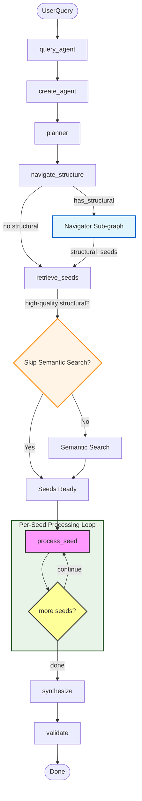
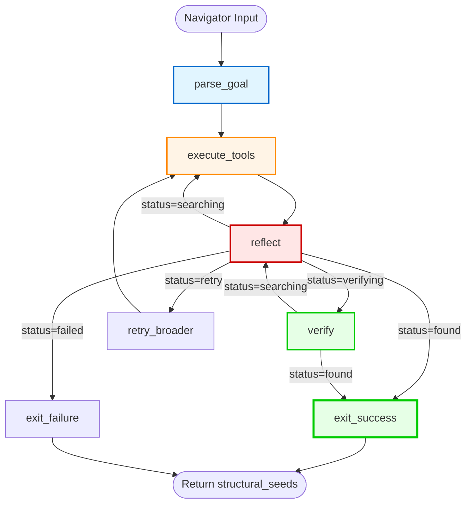
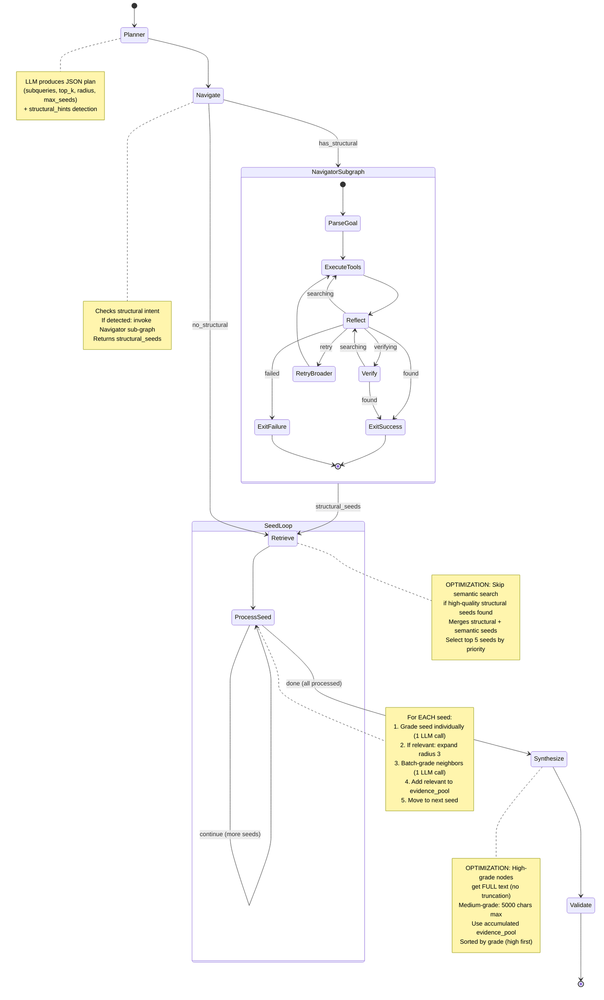

# Retrieval Agent Architecture Flowchart

## Overview
This document visualizes the LangGraph-based agentic retrieval system with **structural navigation sub-graph** and **per-seed processing** architecture.

## Main Agent Flowchart



## Navigator Sub-graph Flowchart



## Complete State Machine



## Detailed Flow Diagram

```
                    START
                     │
                     ▼
        ┌────────────────────────┐
        │  query_agent() called   │
        │  - user_query           │
        │  - title_collection     │
        │  - text_collection      │
        └────────────┬────────────┘
                     │
                     ▼
        ┌────────────────────────┐
        │  create_agent()         │
        │  - Initialize ChatOpenAI│
        │  - Create Navigator    │
        │    Sub-graph            │
        │  - Build StateGraph     │
        │  - Add nodes & edges    │
        └────────────┬────────────┘
                     │
                     ▼
        ┌────────────────────────┐
        │  Initialize State       │
        │  - pending_seeds: []    │
        │  - evidence_pool: []    │
        │  - visited_node_ids: [] │
        │  - structural_seeds: [] │
        └────────────┬────────────┘
                     │
                     ▼
        ┌────────────────────────┐
        │   PLANNER               │
        │   - Generate subqueries │
        │   - Set top_k, radius   │
        │   - Set max_seeds (5)   │
        │   - Detect structural   │
        │     intent              │
        └────────────┬────────────┘
                     │
                     ▼
        ┌────────────────────────┐
        │   NAVIGATE_STRUCTURE    │
        │                         │
        │   ┌─────────────────┐  │
        │   │ Navigator Sub-  │  │
        │   │ graph:          │  │
        │   │                 │  │
        │   │ parse_goal →    │  │
        │   │ execute_tools → │  │
        │   │ reflect →       │  │
        │   │ verify →        │  │
        │   │ exit_success    │  │
        │   └─────────────────┘  │
        │                         │
        │   Returns: structural_  │
        │   seeds (if found)      │
        └────────────┬────────────┘
                     │
                     ▼
        ┌────────────────────────┐
        │   RETRIEVE_SEEDS        │
        │                         │
        │   1. Add structural     │
        │      seeds (if any)     │
        │                         │
        │   2. Check quality:     │
        │      high-grade?        │
        │      ┌──────────────┐   │
        │      │ YES: Skip    │   │
        │      │ semantic     │   │
        │      │ search       │   │
        │      └──────────────┘   │
        │      ┌──────────────┐   │
        │      │ NO: Do       │   │
        │      │ semantic     │   │
        │      │ search       │   │
        │      └──────────────┘   │
        │                         │
        │   3. Select top 5 seeds │
        └────────────┬────────────┘
                     │
                     ▼
        ┌────────────────────────┐
        │   PROCESS_SEED LOOP     │
        │                         │
        │   For each seed:        │
        │   ├─ Grade individually │
        │   ├─ If relevant:       │
        │   │  ├─ Expand radius 3 │
        │   │  ├─ Batch-grade     │
        │   │  └─ Add to evidence │
        │   └─ Move to next seed  │
        └────────────┬────────────┘
                     │
        ┌────────────┴────────────┐
        │                          │
        ▼                          ▼
┌───────────────┐         ┌───────────────┐
│   continue    │         │     done      │
│  (more seeds) │         │ (all seeds    │
│               │         │  processed)   │
└───────┬───────┘         └───────┬───────┘
        │                          │
        └──────┐                   │
               │                   │
               ▼                   ▼
        ┌──────────────┐   ┌───────────────┐
        │ process_seed │   │   SYNTHESIZE   │
        │   (loop)     │   │   - Use top    │
        └──────────────┘   │     evidence   │
                           │   - High-grade │
                           │     nodes: FULL │
                           │     text        │
                           │   - Medium:     │
                           │     5000 chars  │
                           │   - Generate    │
                           │     answer      │
                           └───────┬───────┘
                                   │
                                   ▼
                           ┌───────────────┐
                           │   VALIDATE     │
                           │   - Check      │
                           │     citations  │
                           │   - NO retry   │
                           └───────┬───────┘
                                   │
                                   ▼
                           ┌──────────────┐
                           │      END      │
                           │   Return:     │
                           │   - answer    │
                           │   - evidence  │
                           └───────────────┘
```

## Navigator Sub-graph Details

### Navigator State Machine

```
NavigatorState {
    # Input
    goal: str                    # Natural language goal
    chapter: Optional[int]        # Target chapter number
    position: Optional[str]       # "end" or "beginning"
    section_keywords: List[str]  # Keywords to look for
    
    # Navigation tracking
    landmark_node_id: Optional[str]  # Chapter landmark found
    current_position: str            # Current exploration center
    explored_centers: List[str]      # Prevent re-exploration
    seen_nodes: Dict[str, str]       # node_id → title
    
    # Results
    candidate_nodes: List[Dict]      # Potential matches
    found_nodes: List[str]           # Confirmed node IDs
    
    # Control flow
    messages: List[BaseMessage]       # Conversation history
    iteration: int                   # Current iteration
    max_iterations: int              # Max per scope (8)
    scope_level: int                 # 0=narrow, 1=medium, 2=broad
    status: str                      # searching|verifying|found|failed|retry
    last_action: str                # Description
    reflection: str                  # Agent reflection
    
    # Output
    structural_seeds: List[Dict]     # Final output nodes
}
```

### Navigator Scope Levels

```
Scope 0 (narrow):   radius=10, top_k=5   # Initial focused search
Scope 1 (medium):  radius=15, top_k=8   # After first failure
Scope 2 (broad):    radius=25, top_k=12  # Maximum expansion
```

### Navigator Tools

1. **nav_search_title(query, top_k)**: Semantic search on section titles
2. **nav_explore_titles(node_id, direction, radius)**: See titles around a node
   - direction: "up" (earlier), "down" (later), "both"
   - radius: nodes to explore (default based on scope)
3. **nav_peek_content(node_id)**: Read node content preview
4. **nav_mark_found(node_ids)**: Mark nodes as found

### Navigator Routing Logic

```python
def route_navigator(state):
    if status == "found":
        return "exit_success"
    if status == "failed":
        return "exit_failure"
    if status == "retry":
        return "retry_broader"
    if status == "verifying":
        return "verify"
    if iteration >= max_iter:
        if scope_level < MAX_SCOPE_LEVEL:
            return "retry_broader"
        else:
            return "exit_failure"
    return "execute_tools"
```

### Critical Fixes in Navigator

1. **Preserve "found" status**: `reflect()` now checks if status is already "found" and preserves it
2. **Conditional verify routing**: `verify()` routes based on status (success → exit_success, failure → reflect)
3. **Prevent status override**: Reflection no longer overrides successful verification

## Agent State Structure

```
AgentState {
    messages: List[BaseMessage]           # Conversation history
    user_query: str                       # Original user question
    title_collection: str                 # Title-indexed collection name
    text_collection: str                  # Text-indexed collection name
    final_answer: str                     # Final synthesized answer
    plan: Dict[str, Any]                  # Planner output
    validation: Dict[str, Any]            # Citation validation results

    # Structural navigation state
    structural_seeds: List[Dict[str, Any]]  # Nodes found via navigation

    # Per-seed processing state
    pending_seeds: List[Dict[str, Any]]   # Seeds waiting to be processed (max 5)
    visited_node_ids: List[str]           # MEMORY: don't re-process nodes
    evidence_pool: List[Dict[str, Any]]   # Accumulated relevant nodes (ranked)
    processing_complete: bool             # True when all seeds processed
}
```

## Key Optimizations

### 1. Skip Semantic Search When Navigation Succeeds

**Location**: `retrieve_seeds()`

**Logic**:
```python
has_high_quality_structural = any(
    s.get("relevance_grade") == "high" 
    for s in structural_seeds
)

if has_high_quality_structural and structural_seeds:
    # Skip semantic search - navigation already found perfect match
    logger.info("High-quality structural seeds found, skipping semantic search")
else:
    # Do semantic search to complement structural seeds
    for query in subqueries:
        results = search_by_text(query, ...)
```

**Benefit**: Saves 5+ API calls when Navigator successfully finds the target

### 2. Full Text for High-Grade Nodes

**Location**: `synthesize_answer()`

**Logic**:
```python
if grade == "high":
    snippet = text  # Full text - no truncation
else:
    snippet = text[:5000]  # Increased from 1200 to 5000
```

**Benefit**: High-quality nodes (especially structural seeds) preserve complete context

### 3. Navigator Status Preservation

**Location**: `reflect()` in Navigator sub-graph

**Logic**:
```python
if current_status == "found":
    # Preserve "found" status - don't override
    return {"status": "found", ...}
```

**Benefit**: Prevents successful verification from being overridden by reflection

## Execution Flow Example

```
User Query: "What are the review questions at the end of Chapter 4?"

1. Planner:
   - Detects structural intent: chapter=4, position="end", keywords=["review", "questions"]
   - Generates subqueries: ["chapter 4 review questions", ...]
   - Sets top_k=8, radius=3, max_seeds=5

2. Navigate:
   - Structural intent detected → invoke Navigator sub-graph
   - Navigator: parse_goal → "Find 'review questions' section in Chapter 4 near the end"
   - Navigator: execute_tools → nav_search_title("Chapter 4")
   - Navigator: execute_tools → nav_explore_titles(node_id="0200", direction="down")
   - Navigator: execute_tools → nav_mark_found(["0219"])
   - Navigator: verify → Node 0219 verified ✓
   - Navigator: exit_success → Returns structural_seeds=[{node_id: "0219", relevance_grade: "high", ...}]

3. Retrieve:
   - Structural seeds: 1 node (0219) with relevance_grade="high"
   - Check: has_high_quality_structural = True
   - OPTIMIZATION: Skip semantic search (saves 5 API calls)
   - Seeds: [0219] (1 structural, 0 semantic)

4. Process Seed:
   - Seed 0219: Grade = "high" ✓
   - Expand around 0219: radius=3 → 6 neighbors
   - Batch-grade neighbors: 2 relevant
   - Evidence pool: [0219, neighbor1, neighbor2] (3 nodes)

5. Synthesize:
   - Evidence nodes: 2 high-grade nodes
   - High-grade nodes: FULL text (no truncation)
   - Generate answer with citations

6. Validate:
   - Check citation format
   - Return final answer
```

## Grading Strategy

### Individual Seed Grading
```
grade_single_node(node, query, llm)
    │
    ├─> Send ONE node to LLM
    │   - Title + first 800 chars of text
    │
    ├─> LLM returns: high | medium | low | irrelevant
    │
    └─> Criteria:
        - high: Directly answers or essential
        - medium: Useful context
        - low: Tangentially related
        - irrelevant: Not related
```

### Batch Neighbor Grading
```
grade_neighbors_batch(neighbors, query, llm)
    │
    ├─> Send up to 15 neighbors in ONE LLM call
    │   - Each with first 400 chars of text
    │
    ├─> LLM returns JSON array of grades
    │
    └─> Filter: Keep only high/medium grades
```

## Graph Structure

```
Main StateGraph
├── Entry Point: "planner"
├── Nodes:
│   ├── "planner" → planner() → generates retrieval plan + structural hints
│   ├── "navigate" → navigate_structure() → invokes Navigator sub-graph
│   ├── "retrieve" → retrieve_seeds() → gets top 5 seeds (with optimization)
│   ├── "process_seed" → process_seed() → grades & expands one seed
│   ├── "synthesize" → synthesize_answer() → generates final answer (with full text for high-grade)
│   └── "validate" → validate_citations() → checks citation format
└── Edges:
    ├── planner → navigate
    ├── navigate → retrieve
    ├── retrieve → process_seed
    ├── process_seed → route_seed_processing → process_seed/synthesize
    ├── synthesize → validate
    └── validate → END

Navigator Sub-graph (StateGraph)
├── Entry Point: "parse_goal"
├── Nodes:
│   ├── "parse_goal" → parse_goal() → builds natural language goal
│   ├── "execute_tools" → execute_tools() → LLM calls navigation tools
│   ├── "reflect" → reflect() → reflects on progress (preserves "found")
│   ├── "verify" → verify() → verifies found nodes match goal
│   ├── "retry_broader" → retry_broader() → expands scope and retries
│   ├── "exit_success" → exit_success() → returns structural_seeds
│   └── "exit_failure" → exit_failure() → returns empty seeds
└── Edges:
    ├── parse_goal → execute_tools
    ├── execute_tools → reflect
    ├── verify → route_navigator → exit_success/reflect/...
    ├── reflect → route_navigator → execute_tools/verify/retry_broader/exit_success/exit_failure
    ├── retry_broader → execute_tools
    ├── exit_success → END
    └── exit_failure → END
```

## Data Flow

```
User Query
    ↓
Initial State (pending_seeds=[], evidence_pool=[], structural_seeds=[])
    ↓
Planner → Plan (subqueries, top_k=8, radius=3, max_seeds=5, structural_hints)
    ↓
Navigate → Navigator Sub-graph
    ├─> parse_goal → goal: "Find 'review questions' in Chapter 4 near the end"
    ├─> execute_tools → nav_search_title("Chapter 4")
    ├─> execute_tools → nav_explore_titles("0200", direction="down")
    ├─> execute_tools → nav_mark_found(["0219"])
    ├─> verify → Node 0219 verified ✓
    └─> exit_success → structural_seeds=[{node_id: "0219", relevance_grade: "high", ...}]
    ↓
Retrieve Seeds:
    ├─> Add structural seeds: [0219]
    ├─> Check: has_high_quality_structural = True
    ├─> OPTIMIZATION: Skip semantic search ✓
    └─> Seeds: [0219] (1 structural, 0 semantic)
    ↓
Process Seed 0219:
    ├─> Grade: "high" → Expand → Grade neighbors → Add to evidence
    └─> evidence_pool=[0219, neighbor1, neighbor2]
    ↓
Synthesize → Final Answer (with FULL text for high-grade nodes)
    ↓
Validate → Check citation format
    ↓
Result Dictionary (answer, messages, evidence_count)
```

## Quick Reference Summary

### Main Functions

| Function | Purpose | Key Responsibilities |
|----------|---------|---------------------|
| `query_agent()` | Entry point | Sets up state, creates agent, invokes workflow |
| `create_agent()` | Graph builder | Initializes LLM, creates Navigator sub-graph, builds StateGraph |
| `planner()` | Query planning | Generates subqueries, detects structural intent, sets parameters |
| `navigate_structure()` | Navigation wrapper | Checks structural intent, invokes Navigator sub-graph |
| `retrieve_seeds()` | Initial retrieval | **OPTIMIZATION**: Skips semantic search if high-quality structural seeds found |
| `process_seed()` | Core loop | Grades seed, expands if relevant, grades neighbors |
| `grade_single_node()` | Individual grading | Grades ONE node with LLM |
| `grade_neighbors_batch()` | Batch grading | Grades multiple neighbors in one LLM call |
| `synthesize_answer()` | Answer generation | **OPTIMIZATION**: Full text for high-grade nodes, 5000 chars for medium |
| `validate_citations()` | Quality check | Validates citation format (no retry) |

### Navigator Functions

| Function | Purpose | Key Responsibilities |
|----------|---------|---------------------|
| `parse_goal()` | Goal builder | Converts structural hints into natural language goal |
| `execute_tools()` | Tool executor | LLM calls navigation tools, tracks state |
| `reflect()` | Progress reflection | **FIX**: Preserves "found" status |
| `verify()` | Node verification | Verifies found nodes match goal, routes conditionally |
| `retry_broader()` | Scope expansion | Expands scope level and retries |
| `exit_success()` | Success handler | Returns structural_seeds with relevance_grade="high" |
| `exit_failure()` | Failure handler | Returns empty structural_seeds |

### Termination Conditions

```
Main Agent Termination:
├─> All seeds processed → processing_complete = True → Synthesize
└─> No seeds retrieved → processing_complete = True → Synthesize (empty)

Navigator Termination:
├─> Verification succeeded → status="found" → exit_success
├─> Max iterations reached + max scope → status="failed" → exit_failure
└─> Scope expansion exhausted → status="failed" → exit_failure
```

### Performance Characteristics

- **Max Seeds**: 5 (configurable via planner)
- **Expansion Radius**: 3 nodes in each direction
- **LLM Calls per Seed**: 1 (individual grade) + 1 (batch grade neighbors) = 2 max
- **Navigator Max Iterations**: 8 per scope level
- **Navigator Scope Levels**: 3 (narrow → medium → broad)
- **Total LLM Calls**: 
  - Planner: 1
  - Navigator: 1-24 (depends on success/failure)
  - Seeds: 10 max (5 seeds × 2)
  - Synthesize: 1
  - **Total**: 13-36 calls (optimized: can be as low as 4 if Navigator succeeds immediately)

### Optimizations Summary

1. **Skip Semantic Search**: When Navigator finds high-quality structural seeds, skip semantic search (saves 5+ API calls)
2. **Full Text for High-Grade**: High-grade nodes get full text in synthesis (no truncation)
3. **Status Preservation**: Navigator preserves "found" status to prevent override
4. **Conditional Routing**: Navigator routes verify results conditionally (success → exit, failure → retry)
